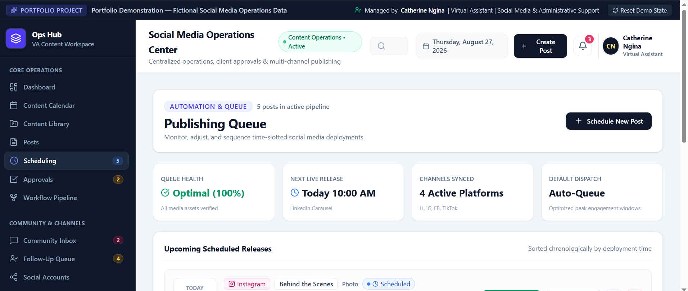
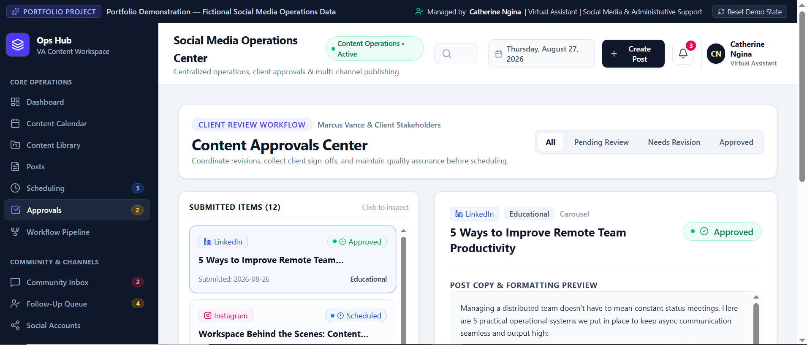

# 📱 Social Media & Content Operations Hub

### Virtual Assistant Portfolio Project

A professional social media operations workspace demonstrating how a Virtual Assistant can manage content planning, content calendars, scheduling, approvals, community management, content research, follow-ups, tasks, and performance reporting across multiple social media platforms.

> **Portfolio Demo:** This project uses fictional sample data and does not represent real clients, customers, or personal information.

---

## 📸 Project Screenshots

### Social Media Operations Dashboard

### Content Calendar

### Scheduling

### Approvals

### Community Inbox

### Operations Tasks

### Follow-Up Queue

---

## 📌 Project Overview

This project demonstrates a full-cycle social media operations workflow managed by a Virtual Assistant.

The system brings content planning, content creation coordination, scheduling, approvals, community management, content research, follow-up management, task tracking, and performance reporting into one organized workspace.

The goal is to demonstrate how a Virtual Assistant can help businesses maintain a consistent social media presence while keeping content, communication, deadlines, and performance data organized.

---

## 🎯 Objectives

- Plan and organize social media content
- Maintain a structured content calendar
- Manage drafts and scheduled posts
- Coordinate content approvals
- Organize social media assets
- Monitor community messages and inquiries
- Manage follow-ups
- Conduct content and competitor research
- Track social media tasks
- Monitor platform performance
- Prepare monthly performance reports
- Identify opportunities for content improvement

---

## ⚙️ Key Features

### 📅 Content Calendar
- Monthly content planning
- Weekly scheduling
- Platform-based content organization
- Content categories
- Publishing times
- Post status tracking

### ✍️ Content Management
- Content ideas
- Draft posts
- Captions
- Content pillars
- Content formats
- Publishing status
- Content duplication

### 🗓️ Social Media Scheduling
- Scheduled posts
- Publishing queue
- Platform selection
- Date and time management
- Rescheduling
- Publishing status

### ✅ Approval Management
- Content review
- Approval tracking
- Revision requests
- Approval notes
- Pending approvals
- Approved content

### 💬 Community Management
- Social media inbox
- Customer inquiries
- Comments and messages
- Response management
- Follow-up tracking
- Escalation

### 🔎 Content Research
- Trending topics
- Competitor research
- Content ideas
- Hashtag research
- Audience questions
- Content opportunities

### 📋 Task Management
- Content tasks
- Approval tasks
- Community management
- Research tasks
- Reporting tasks
- Priority management
- Due dates

### 📈 Analytics & Reporting
- Reach
- Engagement
- Follower growth
- Profile visits
- Link clicks
- Engagement rates
- Platform performance
- Top-performing content

---

## 🔄 Social Media Operations Workflow

Content Research
↓
Content Planning
↓
Content Drafting
↓
Internal Review
↓
Client Approval
↓
Scheduling
↓
Publishing
↓
Community Management
↓
Performance Tracking
↓
Monthly Reporting

---

## 🧰 Skills Demonstrated

- Social Media Management
- Content Planning
- Content Calendar Management
- Social Media Scheduling
- Community Management
- Customer Communication
- Content Research
- Competitor Research
- Administrative Support
- Task Management
- Follow-Up Management
- Data Management
- Analytics & Reporting
- Virtual Assistant Operations

---

## 🌐 Platforms Demonstrated

- LinkedIn
- Instagram
- Facebook
- TikTok

---

## 💻 Technology

- React
- TypeScript
- Vite
- Tailwind CSS
- Local Mock Data
- Responsive UI Design

---

## 👩🏽‍💻 Portfolio Context

**Created by Catherine Ngina**

Virtual Assistant | Social Media & Administrative Support

This fictional portfolio project demonstrates practical social media administration, content coordination, community management, research, follow-up, and reporting workflows.

---

## 📄 Disclaimer

This is a fictional portfolio demonstration. All businesses, customers, social media accounts, messages, statistics, campaigns, and operational data shown in this project are sample data created for demonstration purposes only.
